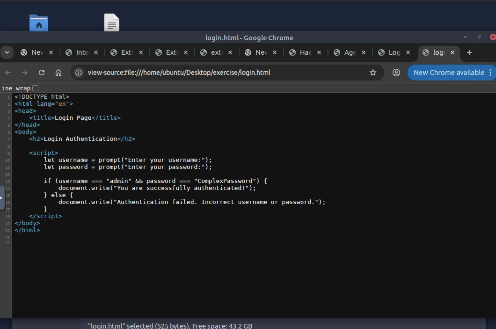
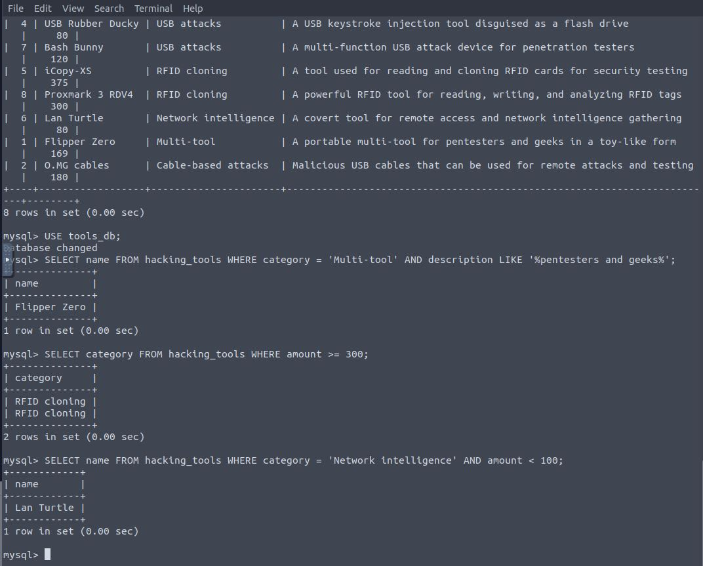
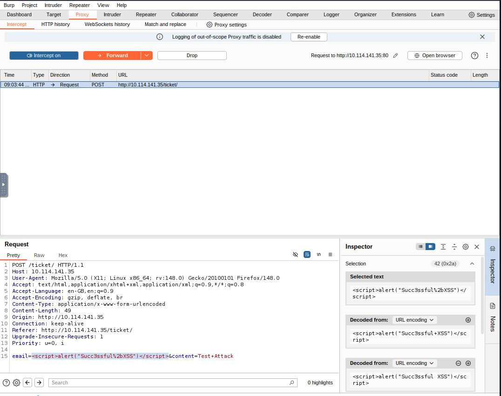
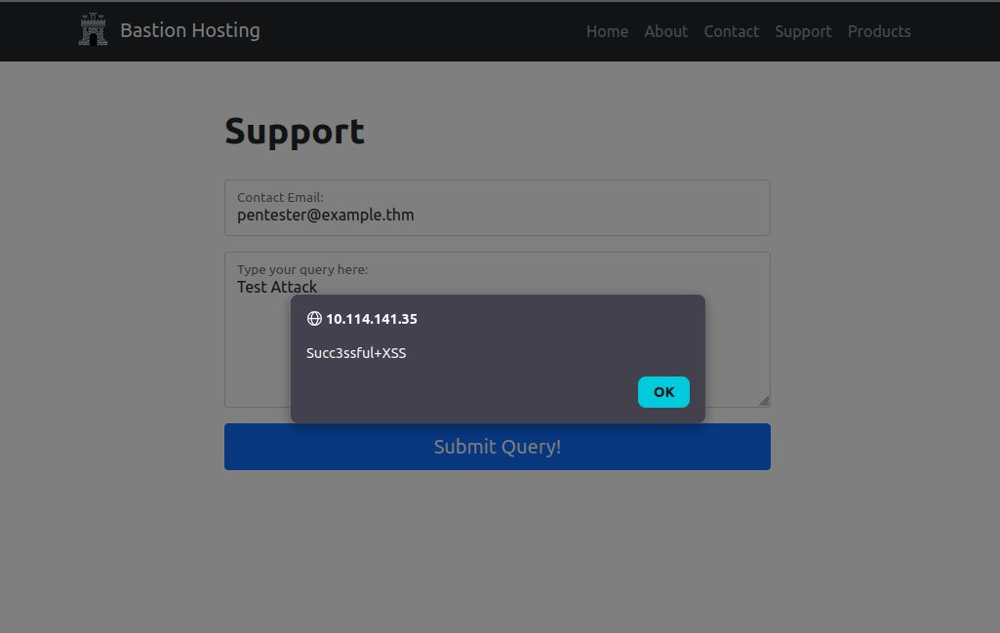

# Web Hacking Fundamentals: HTTP, JavaScript, SQL and Burp Suite

> **Module:** TryHackMe Cybersecurity 101 — Web Hacking  
> **Date completed:** March 2026  
> **Author:** Vilhelm Stjernström

---

## Why This Matters in Security Operations

To defend a web application, a SOC analyst must thoroughly understand the underlying communication and data structures. Web attacks rarely look like Hollywood hacking - they look like manipulated HTTP requests, bypassed client-side logic, and anomalous database queries. If a defender cannot distinguish between a legitimate client-side session update and a malicious parameter tampering attempt, they cannot effectively write detection rules or triage alerts.

Web application attacks consistently dominate the OWASP Top 10 and account for the majority of initial access vectors in real-world breaches. Understanding how these attacks work at the HTTP level is what allows a SOC analyst to read WAF logs and web server access logs with confidence rather than guesswork.

---

## Core Concepts

### The HTTP Protocol and In-Flight Manipulation

HTTP is the foundational language of the web, operating on a simple request/response model. As a defender, the critical principle to internalize is that everything sent from the client — headers, cookies, parameters, hidden form fields — is untrusted user input. All of it.

Attackers intercept this traffic before it reaches the server and alter it freely. If a security system relies solely on the browser to validate input (such as checking that a price field hasn't been modified), an attacker can simply bypass it by modifying the raw HTTP POST request using a proxy. This is why server-side validation is non-negotiable — anything enforced only on the client side is a suggestion, not a security control.

### Client-Side vs. Server-Side Logic (The JavaScript Trap)

Modern web applications push a significant amount of processing to the user's browser via JavaScript. While this is great for performance, it becomes a security nightmare if developers trust client-side logic for authentication or authorization. An analogy that stuck with me: it's like having a bouncer check IDs inside the club rather than at the door — anyone can walk in and the check becomes meaningless.

During this module, I saw firsthand how variables like `authenticated = false` can be changed to `true` directly in the browser's Developer Tools, completely bypassing access controls. This was an eye-opener — it made me realize that every JavaScript variable and every client-side check is fully visible and modifiable by anyone with a browser. There is no such thing as a client-side secret.

### Relational Databases and SQL Syntax

Databases are the digital vaults of an organization. They consist of tables (think filing cabinets) containing rows and columns (individual records and their attributes). SQL (Structured Query Language) is the standard language for interacting with this data through CRUD operations — Create, Read, Update, and Delete.

Understanding how operators like `AND`, `OR`, and `=` work, along with functions like `GROUP_CONCAT()`, is essential. Attackers abuse the logic of SQL queries to force the database into returning sensitive information it was never meant to expose. For a SOC analyst, this means that unusual SQL syntax appearing in web traffic or access logs — characters like single quotes, `UNION SELECT`, `OR 1=1`, or semicolons — should immediately raise red flags.

What surprised me about SQL injection is how subtle it can be. A skilled attacker doesn't dump the entire database at once — they use precise, filtered queries to extract exactly what they need (like admin credentials), keeping payloads small to avoid tripping volumetric data exfiltration alarms. Understanding this attacker mindset helps me think about what detection rules would actually catch a careful adversary versus only catching noisy, automated scanners.

### Burp Suite — The Web Application Testing Workstation

Burp Suite ties all the concepts above together into a single tool. At its core, Burp acts as a proxy sitting between the browser and the web server, intercepting every HTTP request and response passing through. This gives you complete visibility into — and control over — the data flowing between client and server.

The key components I worked with were **Proxy** (intercept and inspect live traffic), **Repeater** (manually modify and resend individual requests to test how the server responds), and **Scope** (filter out noise by limiting Burp to only capture traffic for the target application).

One thing that clicked during this room was how Burp handles HTTPS traffic — it installs its own CA certificate in the browser, effectively performing the same TLS inspection I wrote about in my cryptography write-up. The browser trusts Burp's certificate, so Burp can decrypt, display, and modify the traffic before re-encrypting and forwarding it. Seeing this in practice made the concept of corporate TLS inspection proxies much more concrete.

---

## Hands-On: What I Practiced

### JavaScript Manipulation

I accessed the browser's Developer Console to manually change Boolean variables handling user sessions. By flipping `authenticated = false` to `true`, I escalated privileges without valid credentials — demonstrating why client-side authentication checks are fundamentally broken as a security control.

What made this even more striking was viewing the page source and finding hardcoded credentials directly in the JavaScript — username and password in plaintext, visible to anyone who right-clicks and selects "View Source."



I initially expected this to be more complicated than it was. The fact that it took about ten seconds to bypass a login screen by reading the source code was genuinely unsettling and a powerful reminder of why server-side validation exists.

### SQL Data Extraction

I interacted directly with a relational database through terminal commands, using `SELECT` statements combined with logical operators to surgically extract specific records:

```sql
SELECT name FROM hacking_tools WHERE category = 'Network Intelligence' AND amount < 100;
```

This type of precise filtering mirrors how real attackers operate — targeting specific high-value data rather than performing bulk extractions that would trigger alerts.



### HTTP Interception and XSS with Burp Suite

Using Burp Suite's Proxy, I intercepted a live HTTP POST request and injected an XSS payload directly into the email parameter. Burp's Inspector panel showed the URL-encoded payload being decoded in real-time, giving me full visibility into how the malicious script would be processed by the server.



The injected script executed successfully on the target application, producing an alert popup — confirming a reflected XSS vulnerability. This demonstrated the full attack chain: intercept the request in Burp, modify a parameter with a malicious payload, forward it to the server, and observe the result.



*(No specific TryHackMe flags or exact task solutions are shared in this write-up.)*

---

## SOC Analyst Relevance — How I'd Use This on the Job

### 1. Detecting Client-Side Bypass Attempts

If I saw an alert for anomalous HTTP POST requests containing mismatched parameters, for example, a shopping cart total showing $0.00 while the item ID corresponds to a high-value product — I would immediately investigate this as a client-side bypass attempt. The attacker likely intercepted and modified the request between the browser and the server, altering the price parameter while keeping everything else intact. Understanding this attack pattern from hands-on practice means I know exactly which log fields to examine.

### 2. Identifying SQL Injection in Access Logs

If I noticed unusual characters in our web server's access logs, patterns like `' OR 1=1 --`, `UNION SELECT`, or `GROUP_CONCAT()` — I would escalate immediately as a potential SQL injection attempt. These are not strings that appear in legitimate user input. I would correlate with the WAF logs to check whether the payload was blocked or passed through, and examine the response size to determine whether data exfiltration may have succeeded.

### 3. Recognizing Proxy-Based Attacks

If our WAF or IDS flagged requests with unusual header patterns — such as missing or modified `User-Agent` strings, inconsistent `Referer` headers, or requests arriving at speeds impossible for manual browsing — I would consider that the attacker is using an interception proxy like Burp Suite to automate or manipulate traffic. This context, gained from using Burp myself, helps me understand what proxy-based attack traffic actually looks like versus normal user behavior.

---

## Key Takeaways

- **Client-side security is an illusion:** Any validation done in the browser can and will be bypassed by an attacker. The ease with which I changed a JavaScript variable to bypass authentication made this principle visceral rather than theoretical — it took less time than making a cup of coffee.

- **Everything is an input:** Cookies, headers, hidden form fields, and URL parameters are just as vulnerable to manipulation as a standard search box. If it leaves the browser, it can be modified.

- **Precision matters for attackers:** Skilled threat actors use logical operators to filter extracted data (targeting specific admin accounts, for example) to keep payloads small and avoid triggering volumetric detection rules. Understanding this helps me write detection logic that catches careful adversaries, not just automated scanners running default payloads.

- **TLS inspection is a double-edged sword:** Seeing Burp Suite perform TLS interception firsthand connected directly to my cryptography studies — the same technique that allows security teams to inspect encrypted corporate traffic is also what allows attackers to intercept and modify HTTPS requests.

---

## What I Want to Explore Further

- **Blind SQL Injection:** I want to understand how attackers extract data when the application doesn't directly display query results — using techniques like Boolean-based and time-based blind SQLi that infer information from subtle differences in server responses.

- **Advanced Burp Suite workflows:** I want to explore Burp's Intruder module for automating parameter fuzzing and brute-force attacks, and learn how to write custom match-and-replace rules for more efficient testing.

- **Cross-Site Scripting (XSS) in depth:** While this module touched on JavaScript manipulation, I want to dive deeper into stored, reflected, and DOM-based XSS — and understand how Content Security Policy (CSP) headers are used as a defense mechanism.

---

*Completed as part of TryHackMe's Cybersecurity 101 path. This write-up represents my personal understanding — no TryHackMe answers or flags are disclosed.*
