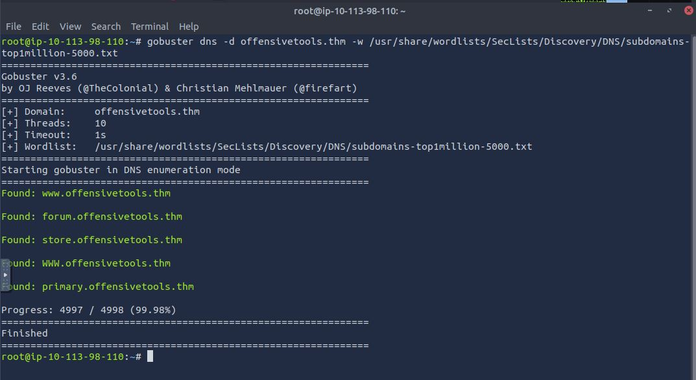
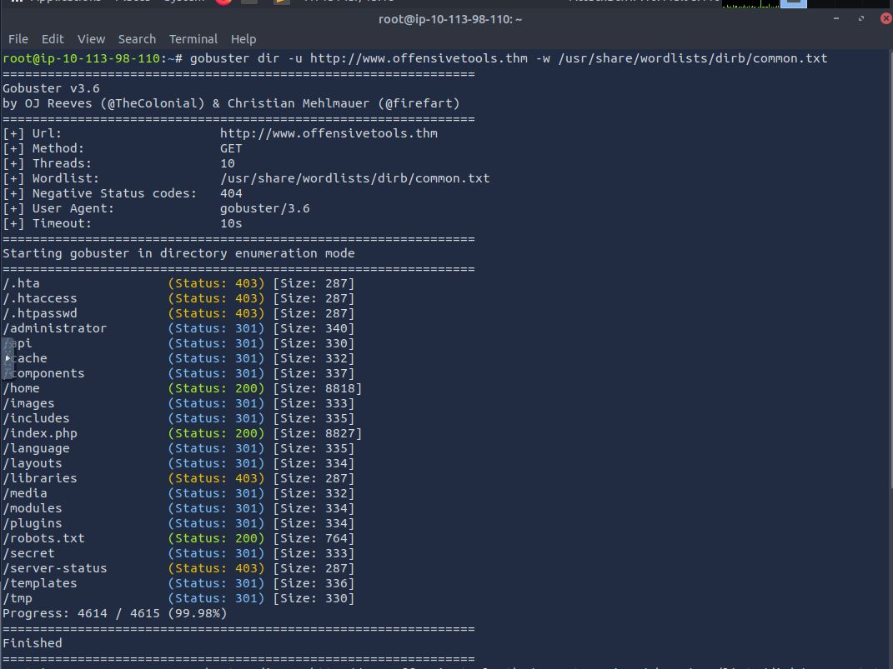
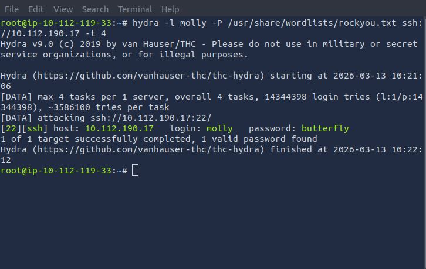
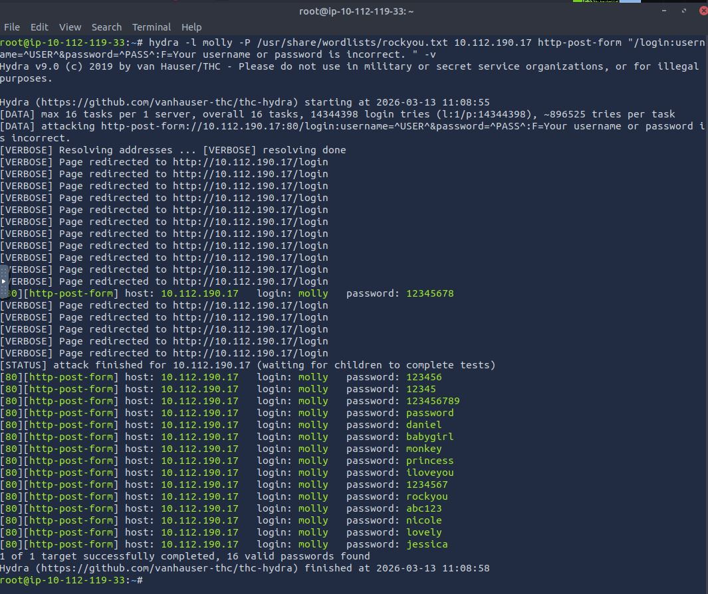
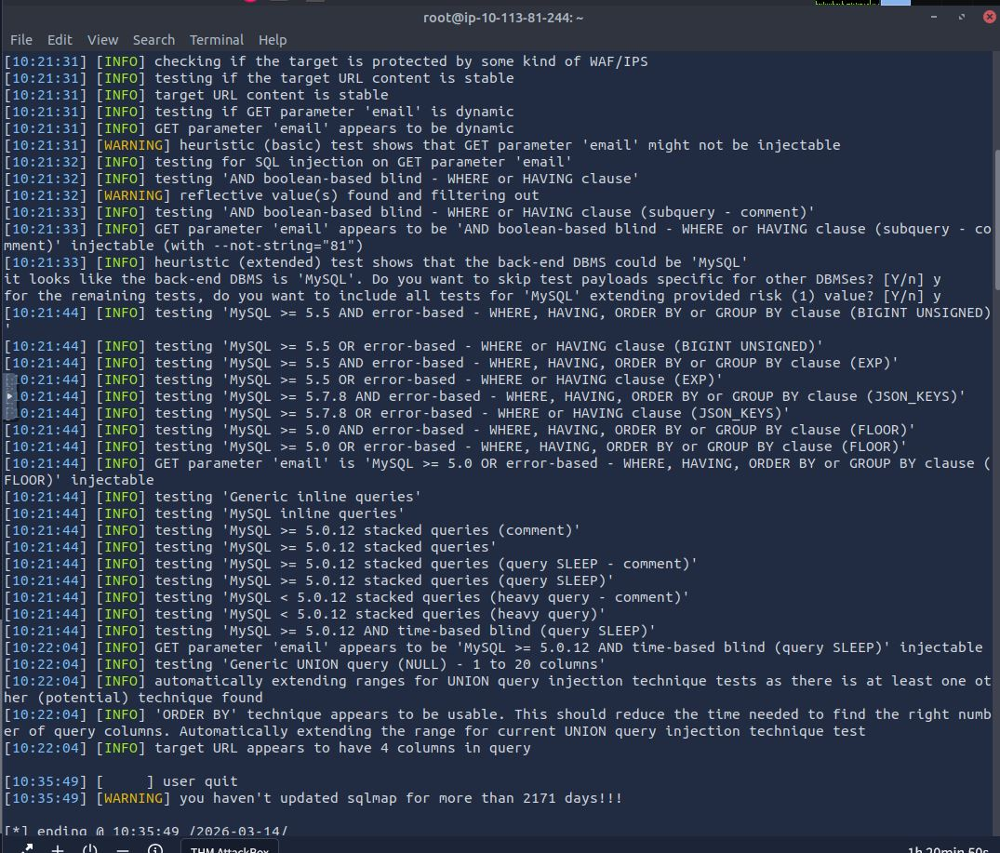
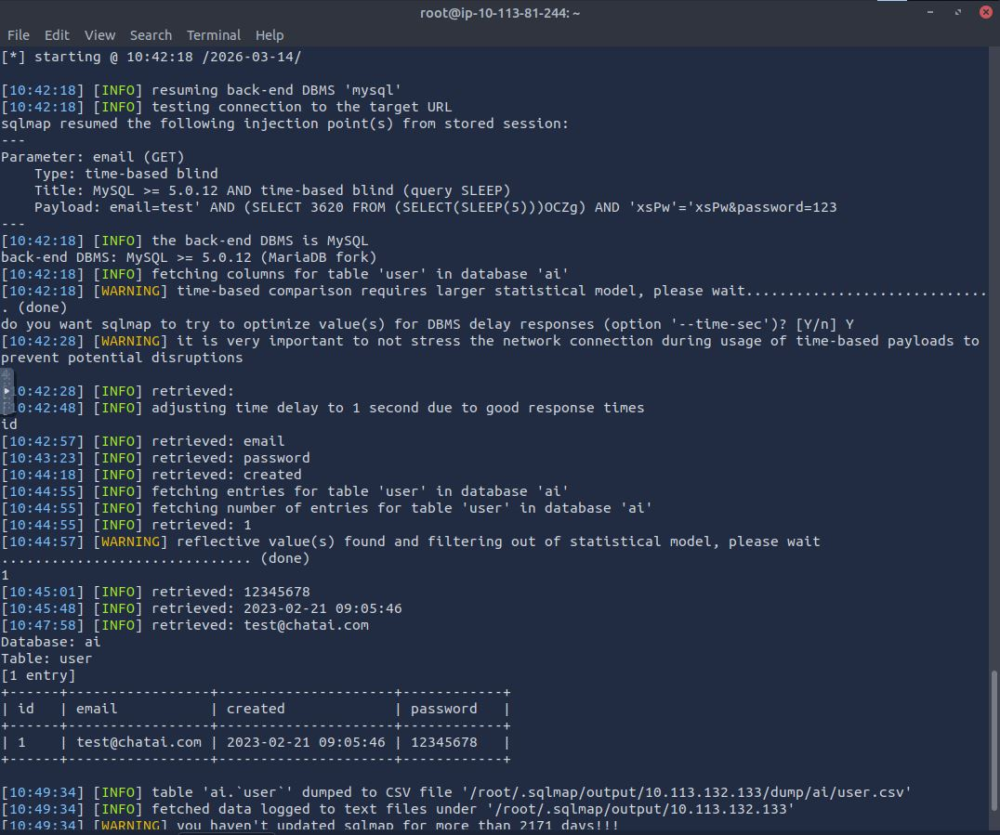

# Offensive Security Tooling: The Attacker's Arsenal

> **Module:** TryHackMe Cybersecurity 101 — Offensive Security Tooling  
> **Date completed:** March 2026  
> **Author:** Vilhelm Stjernström

---

## Why This Matters in Security Operations

Understanding how offensive tools work is essential for any SOC analyst. You cannot defend a network against threats you don't understand. By knowing exactly how attackers automate their reconnaissance and credential cracking, I can identify these signatures in our logs. When I understand how much noise tools like GoBuster or SQLMap generate on a network, I can tune our detection systems (SIEM/IDS) to catch these attacks before they escalate into a full-scale breach.

This module covered three categories of offensive tools — each representing a different phase of the attack lifecycle: reconnaissance (GoBuster), authentication attacks (Hydra), and exploitation with data exfiltration (SQLMap and web shells).

---

## Core Concepts

### Reconnaissance and Enumeration (GoBuster)

GoBuster is an extremely fast, automated tool written in Go that brute-forces hidden web directories, DNS subdomains, and virtual hosts. Instead of an attacker manually guessing whether a website has a hidden `/admin` folder, GoBuster sends thousands of requests per second using a wordlist. In a security context, this matters because unknown or forgotten web endpoints — sometimes called "shadow IT" — are often the weakest link into a company's network. An exposed `/administrator` panel or a forgotten development subdomain can be all an attacker needs.

### Authentication Brute-Forcing (Hydra)

Hydra is the network's battering ram. It's a fast and flexible tool for performing dictionary attacks against over 50 different login protocols, including SSH, FTP, and web forms (HTTP POST/GET). It methodically feeds combinations of usernames and passwords until it gets a hit. For a SOC analyst, understanding Hydra demonstrates exactly why strong password policies, multi-factor authentication, and account lockout mechanisms (like locking an account after 3-5 failed attempts) are non-negotiable security controls.

### Exploitation and Data Exfiltration (SQLMap and Shells)

SQLMap is an automated testing tool that discovers and exploits SQL injection vulnerabilities to take over databases. A shell (reverse shell or web shell) is the next step in the chain — a piece of code that gives the attacker a remote command line on the compromised server. This is the nightmare scenario: once an attacker has a shell or can dump the database with SQLMap, they have full control over the organization's crown jewels. Understanding how these tools work helps me recognize their signatures in logs and understand the full scope of what an attacker can achieve once they find even a single injection point.

---

## Hands-On: What I Practiced

My methodology throughout this module followed the Cyber Kill Chain model — from reconnaissance to exploitation.

### Step 1: DNS and Directory Enumeration (GoBuster)

I used GoBuster with custom wordlists to map out a seemingly empty web server, uncovering hidden infrastructure that wasn't visible through normal browsing.

Using `gobuster dns`, I discovered multiple subdomains including `forum`, `store`, and `primary` — each representing a potential attack surface that administrators may have forgotten about:

Following up with `gobuster dir`, I enumerated the web server's directory structure and found sensitive paths including `/administrator`, `/api`, `/secret`, and `/robots.txt` — directories that should never be publicly accessible in a production environment:

### Step 2: Authentication Bypass (Hydra)

I tested the security of login portals by targeting both an SSH service and an HTTP login form with Hydra.

**SSH brute-force:** Using Hydra with the `rockyou.txt` wordlist against the SSH service, the tool cracked the credentials within about a minute — demonstrating how quickly weak passwords fall to automated attacks:

**Web form brute-force — where I struggled:** My first attempt at brute-forcing the HTTP login form returned 16 "valid" passwords, which was clearly wrong. The issue was that Hydra was matching on the wrong failure condition — every redirect was being counted as a success. This taught me an important lesson: the `-F` (failure string) parameter must exactly match the error message on the page, or Hydra will report false positives. After inspecting the page source to find the exact error string and adjusting my command, I got a clean, single result:

*The screenshot above shows the "optimistic" false positive run — a great reminder that blindly trusting tool output without validating results leads to wasted time and wrong conclusions. In a real engagement, reporting 16 valid passwords when only one actually works would be a credibility-destroying mistake.*

### Step 3: Exploitation via SQLMap

I discovered a vulnerable email parameter on a web application's login page. By targeting it with SQLMap (`sqlmap -u [URL] --dump`), the tool identified multiple injection types — including boolean-based blind and time-based blind SQL injection:

SQLMap then exploited the time-based blind injection to enumerate the database structure, extract table names, and ultimately dump the entire backend database — including plaintext credentials:

Watching SQLMap slowly extract data character by character through time delays was eye-opening. Each piece of information took 15-20 seconds to retrieve, meaning the full dump took several minutes. This is important from a defensive perspective — time-based blind SQLi creates a distinctive pattern of requests with artificially delayed responses that a properly configured WAF or SIEM should be able to detect.

*(No specific TryHackMe flags or exact task solutions are shared in this write-up.)*

---

## SOC Analyst Relevance — How I'd Use This on the Job

### 1. Detecting Directory Enumeration Attacks

If I was monitoring web traffic and suddenly saw an extremely high volume of HTTP 404 (Not Found) responses directed at our web server from a single IP address within a very short timeframe, I would immediately suspect a GoBuster or DirBuster directory enumeration attack. The pattern is unmistakable: hundreds of requests per second, sequential paths, all returning 404s except the occasional 200 or 301. I would investigate the source IP and potentially block it at the firewall while assessing what directories were discovered.

### 2. Identifying Brute-Force Attacks in Authentication Logs

If our SIEM alerted on 100+ failed login attempts against our SSH server (Event ID 4625 on Windows or repeated `Failed password` entries in Linux auth.log) within a span of minutes from the same source, I would conclude that a brute-force attack similar to Hydra is in progress. I would verify that our Fail2Ban or rate limiting mechanisms have activated, check whether any attempts succeeded, and if so, immediately isolate the affected account and begin incident response.

### 3. Recognizing Automated SQL Injection

If I was reviewing web server logs and discovered GET requests containing unexpected SQL operators, `SLEEP()` commands, or encoded injection payloads, I would know that someone is attempting automated SQL injection with a tool like SQLMap. The time-based blind technique is particularly identifiable — look for repeated requests to the same endpoint with incrementally different payloads and artificially consistent response times. I would escalate the incident and examine whether the server responded with HTTP 200, which could indicate successful data exfiltration.

---

## Key Takeaways

- **Automation is terrifyingly fast:** Watching SQLMap break down a database and dump its contents in minutes fundamentally changed my perspective on why input sanitization and parameterized queries are priority number one for developers. The gap between "we have a SQL injection vulnerability" and "our entire database is compromised" is measured in minutes, not days.

- **The noise is the attacker's weakness:** Despite being powerful, these tools generate massive amounts of network traffic. This is a significant advantage for Blue Teams — they "scream" in the logs unless used very carefully. A SOC analyst who understands what GoBuster traffic looks like (hundreds of 404s per second) or what Hydra looks like (rapid sequential authentication failures) can write detection rules that catch 90% of automated attacks.

- **Reconnaissance is everything:** The reconnaissance phase is the most important step in any attack. Cracking passwords is difficult, but finding a forgotten, unprotected subdomain or an exposed admin panel makes brute-forcing unnecessary. This is why asset management and attack surface monitoring are critical defensive practices.

- **Tool output requires validation:** My Hydra false positive experience was a valuable lesson — blindly trusting automated tool output without critical analysis leads to wrong conclusions. This applies equally to defensive tools: a SIEM alert is a starting point for investigation, not a confirmed incident.

---

## What I Want to Explore Further

- **Evasion techniques:** I want to understand how advanced threat actors use these same tools with adjusted threading, time delays, and request throttling to fly under SIEM detection thresholds — and how to build detection rules that catch even careful adversaries.

- **Defensive SIEM visualization:** I'm looking forward to working with tools like Splunk and Elastic to see exactly how these attack patterns appear on a SOC analyst's screen — correlating the offensive techniques I've practiced with the defensive telemetry they generate.

- **Custom wordlist generation:** Understanding how attackers build targeted wordlists using OSINT (company names, employee data, industry terminology) would help me assess whether our password policies are truly resistant to targeted dictionary attacks.

---

*Completed as part of TryHackMe's Cybersecurity 101 path. This write-up represents my personal understanding — no TryHackMe answers or flags are disclosed.*
